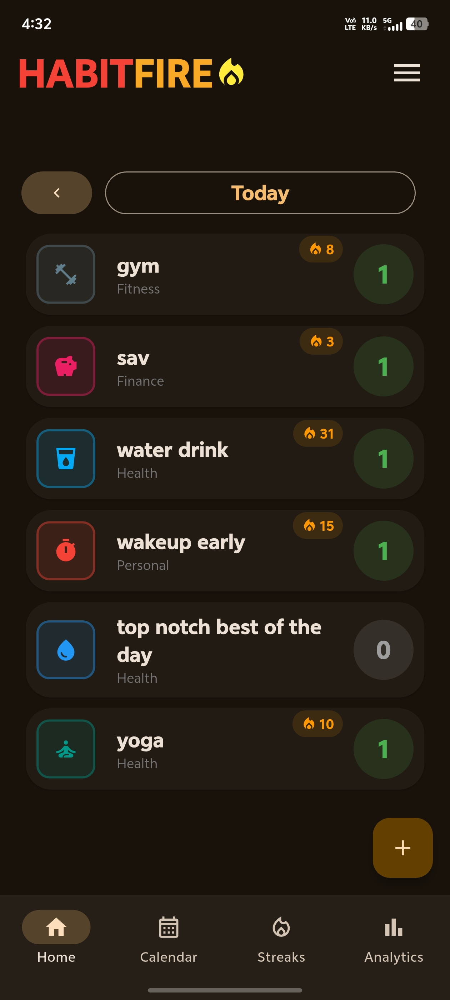
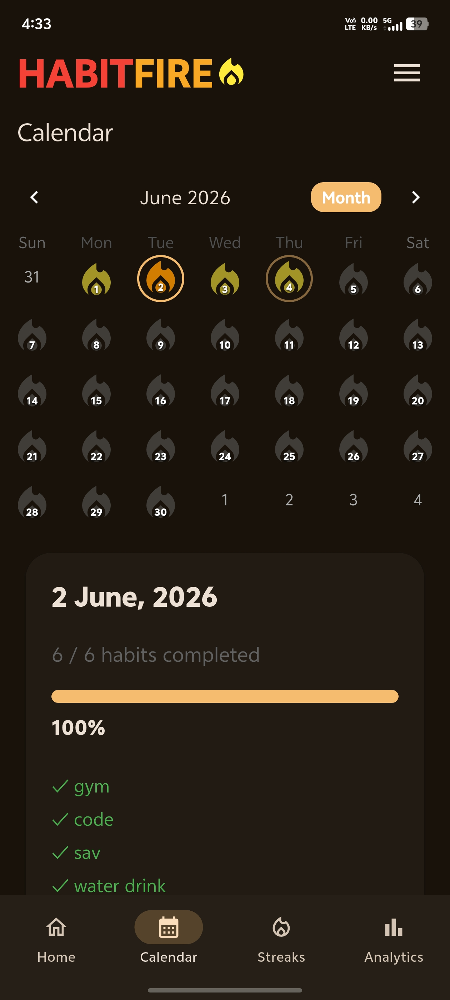
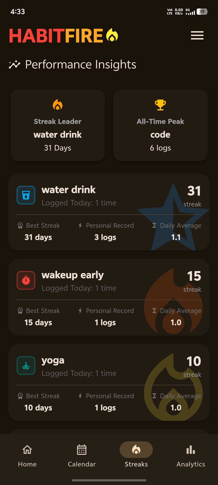
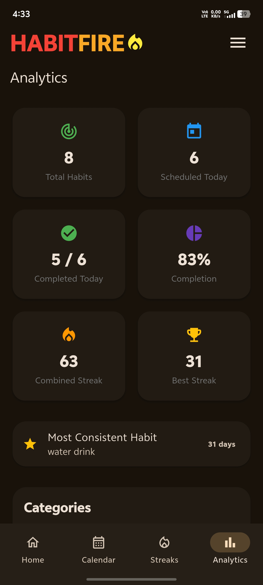

# 🔥 HabitFire

**HabitFire** is a modern Flutter habit-tracking application built to help users develop consistency, maintain streaks, and visualize progress through powerful analytics. With a clean dark-themed UI, streak tracking, calendar history, import/export support, and habit scheduling, HabitFire makes habit building simple and motivating.

---

## 📱 Screenshots

### Home


### Calendar


### Streaks


### Analytics


---

## ✨ Features

### 📝 Habit Management
- Create, edit, and delete habits
- Custom habit icons
- Category-based organization
- Custom colors for icons
- Daily habit tracking
- Habit scheduling by weekdays
- Swipe-to-delete support

### 🔥 Streak System
- Current streak tracking
- Best streak records
- Combined streak statistics
- Streak leader insights
- Personal records per habit
- Daily average calculations

### 📅 Calendar Tracking
- Monthly habit overview
- Daily completion history
- Progress percentage visualization
- Habit completion details for any date
- Visual streak heatmap using fire indicators

### 📊 Analytics Dashboard
- Total habits
- Habits scheduled today
- Completion rate
- Completed habits today
- Combined streaks
- Best streak achieved
- Most consistent habit
- Category breakdown
- Performance statistics

### 🌙 Theme Support
- Dark Mode
- Light Mode
- Theme toggle support

### 💾 Backup & Restore
- Export all habits and progress
- Import backup data
- Easy migration between devices

### ℹ️ Additional Pages
- About Page
- App Information
- Feature Overview

### 🎨 User Experience
- Smooth animations
- Motivational splash quotes
- Modern dark UI
- Material Design
- Responsive layouts

---

## 🏗️ Tech Stack

| Technology | Usage |
|------------|--------|
| Flutter | Cross-platform framework |
| Dart | Programming language |
| Hive | Local database |
| Hive Generator | Type adapters |
| Build Runner | Code generation |
| Material Design | UI framework |

---

## 📂 Project Structure

```text
lib/
│
├── main.dart
│
└── app/
    │
    ├── app.dart
    ├── router.dart
    │
    ├── models/
    │   ├── habit.dart
    │   └── habit.g.dart
    │
    ├── pages/
    │   │
    │   ├── home/
    │   │   └── presentation/
    │   │       └── home_page.dart
    │   │
    │   ├── addhabit/
    │   │   └── presentation/
    │   │       └── add_habit_page.dart
    │   │
    │   ├── calendar/
    │   │   └── presentation/
    │   │       └── calendar_page.dart
    │   │
    │   ├── streak/
    │   │   └── presentation/
    │   │       └── streak_page.dart
    │   │
    │   ├── analytics/
    │   │   └── presentation/
    │   │       └── analytics_page.dart
    │   │
    │   └── about/
    │       └── presentation/
    │           └── about.dart
    │
    ├── shared/
    │   └── navigation/
    │       ├── main_navigation_shell.dart
    │       └── upper_nav.dart
    │
    ├── widgets/
    │   ├── habit_card.dart
    │   └── navup.dart
    │
    └── utils/
        ├── backup_service.dart
        ├── edit_habit_dialog.dart
        └── iconcolors.dart
```

---

## 🔥 Habit Model

Each habit contains:

```dart
String id;
String title;
String category;
int iconCodePoint;
DateTime createdAt;

Map<String, int> dailyCounts;
List<int> weekDays;
```

### Weekday Scheduling

```dart
[1,2,3,4,5]
```

Represents:

```text
1 = Monday
2 = Tuesday
3 = Wednesday
4 = Thursday
5 = Friday
6 = Saturday
7 = Sunday
```

Examples:

| Habit | Schedule |
|---------|----------|
| Gym | Mon-Sat |
| Cricket | Sat-Sun |
| Water Drink | Everyday |

---

## 📈 Analytics Provided

HabitFire automatically calculates:

- Current streak
- Best streak
- Combined streak
- Completion percentage
- Scheduled habits today
- Completed habits today
- Most consistent habit
- Category statistics
- Personal records
- Daily averages

---

## 🚀 Getting Started

### Clone Repository

```bash
git clone https://github.com/yourusername/habitfire.git
cd habitfire
```

### Install Dependencies

```bash
flutter pub get
```

### Generate Hive Adapters

```bash
flutter pub run build_runner build --delete-conflicting-outputs
```

### Run Application

```bash
flutter run
```

---

## 📦 Main Dependencies

```yaml
dependencies:
  flutter:
  hive:
  hive_flutter:
  file_picker:
  path_provider:

dev_dependencies:
  build_runner:
  hive_generator:
```

---

## 💡 Future Improvements

- Local notifications
- Reminder system
- Habit goals
- Achievement badges
- Heatmap analytics
- Cloud sync
- Google Sign In
- Data synchronization across devices
- Widgets for Android & iOS
- CSV export

---

## 🤝 Contributing

Contributions are welcome.

1. Fork the repository
2. Create a new branch

```bash
git checkout -b feature/new-feature
```

3. Commit changes

```bash
git commit -m "Add awesome feature"
```

4. Push changes

```bash
git push origin feature/new-feature
```

5. Open a Pull Request

---

## 👨‍💻 Developer

**Naga Teja**

Built using Flutter to help users build strong habits, maintain consistency, and achieve long-term goals.

---

## 📜 License

MIT License

---

> "Success is the product of daily habits—not once-in-a-lifetime transformations."

🔥 **Build Habits. Track Progress. Keep the Fire Alive.**